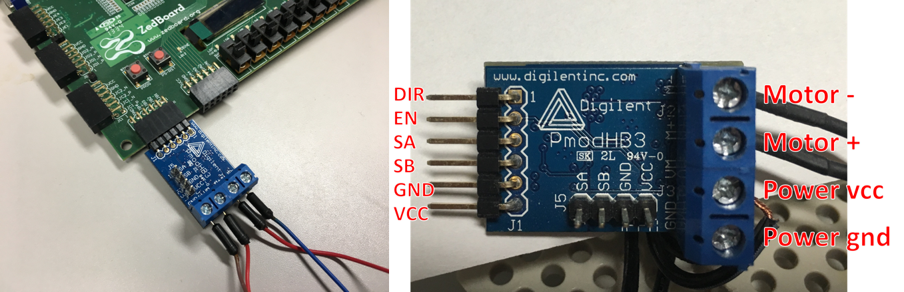
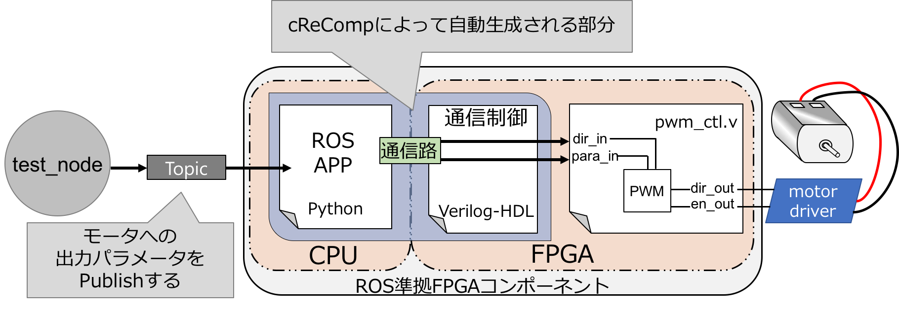

# PWM回路のコンポーネント化

## 作業の前に

これらより、`~/exp_dir`のことをワークスペースと呼びます。
ワークスペースに以下のファイルがあるか確認してください。

- pwm_ctl.v
- bootgen.zip

また、ハードウェアをダウンロードします。
以下コマンドで取得するか、[このURL](http://xillybus.com/downloads/xillinux-eval-zedboard-1.3c.zip)からワークスペースにダウンロードしてください。

```
wget http://xillybus.com/downloads/xillinux-eval-zedboard-1.3c.zip
```

アーカイブファイルの展開をします。

```
$ unzip bootgen.zip
$ unzip xillinux-eval-zedboard-1.3c.zip
```

cReCompが動作するか確認します。

```
$ crecomp -h
Usage: crecomp [option] [file name] [-u user logic path]+

Options:
  -h, --help            show this help message and exit
  -u USERLOGIC, --userlogic=USERLOGIC
                        specifier your user logic name
  -p PYTHON_TEMPLATENAME, --python_template=PYTHON_TEMPLATENAME
                        specifier for template name
  -s SCRP_TEMPLATENAME, --scrp_template=SCRP_TEMPLATENAME
                        specifier for template name
  -b SCRP_PATH, --build=SCRP_PATH
                        specifier target scrp file to build for componentize
  -t TEST_PATH, --test=TEST_PATH
                        generate testbench of target user logic
```

## ユーザロジックの機能とモータドライバ

今回使用する回路記述はPWM制御を行う回路`pwm_ctl.v`です。  
以下のようなインターフェイスになっています。  
`pwm_ctl.v`は**input信号のdir_in、para_in**へ、それぞれ回転方向とモータの回転速度のためのパラメータを入力することで、モータ制御をします。

| タイプ | 幅 | 信号名  |                役割                |
|--------|----|---------|------------------------------------|
| input  |  1 | clk     | クロック信号                       |
| input  |  1 | rst     | リセット信号                       |
| input  | 15 | para_in | モータ出力を決めるためのパラメータ |
| input  |  1 | dir_in  | モータの回転方向                   |
| output |  1 | dir_out | モータの回転方向                   |
| output |  1 | en_out  | PWM制御の信号                      |

また、パラメータの値域は以下の通りです。  
**para_inは入力値を大きくすればするほど低出力になることに注意してください。**

- dir_in : 1(正回転) or 0(逆回転)
- para_in : 0 〜 19999 (高出力〜低出力)

FPGAボード(Zedboard)にDigilentのモータドライバ(PmodHB3)を装着しモータを接続します。モータドライバへ適切な電気信号を出力することで、モータを制御することができます。  

下の写真右にはモータドライバのピンの役割を示しています。  
**DIR**をポジティブ(DIR = 1)にするとモータは正回転します。また、**EN**においてPWM制御の信号を入力することで、モータの回転速度が決まります。（SAとSBは今回は使用しません。）



## コンポーネント化

今回、作成するシステムの機能仕様は以下のようなものです。

- 機能1：モータをPWMによって制御
- 機能2：FPGA上の回路へ、ソフトウェアからパラメータを渡せるようにする
- 機能3：ROSのメッセージによって回路へのパラメータを渡せるようにする

<center>

</center>

図のようにコンポーネントはソフトウェアとハードウェアの混合システムとなっています。  
特に、cReCompではハードウェアインターフェイスとソフトウェアインターフェイスを設定に応じて自動生成することができ、開発者の皆さんはVerilog HDLの記述やデータをやり取りするためのソフトウェア記述はいりません。  

はじめに、以下のコマンドで設定ファイルを作成します。
`Generate config.py successfully`が出力されたら成功です。

```
$ crecomp -p config.py -u pwm_ctl.v
Generate config.py successfully
```

作成に成功すると`~/exp_dir/config.py`ができ、以下のような内容になっているはずです。

```python
#!/usr/bin/python
# -*- coding: utf-8 -*-

import crecomp.userlogic as ul
import crecomp.component as cp
import crecomp.verilog as vl
import crecomp.communication as com


class Pwm_ctl(ul.Util):

	def __init__(self,uut):
		self.name = "pwm_ctl"
		self.filepath = "pwm_ctl.v"
		self.uut = uut
		self.ports =[
		vl.Input("clk", 1),
		vl.Input("rst", 1),
		vl.Input("para_in", 15),
		vl.Input("dir_in", 1),
		vl.Output("dir_out", 1),
		vl.Output("en_out", 1)
		]
		self.assignlist = []

cp_pwm_ctl = cp.Component("component_pwm_ctl")


# ==================== for userlogic pwm_ctl.v ====================
pwm_ctl = Pwm_ctl("uut")

# adding signal for connection to user logic
cp_pwm_ctl.add_input("clk",1)
cp_pwm_ctl.add_input("rst",1)
cp_pwm_ctl.add_input("para_in",15)
cp_pwm_ctl.add_input("dir_in",1)
cp_pwm_ctl.add_output("dir_out",1)
cp_pwm_ctl.add_output("en_out",1)

# cp_pwm_ctl.add_reg("clk",1)
# cp_pwm_ctl.add_reg("rst",1)
# cp_pwm_ctl.add_reg("para_in",15)
# cp_pwm_ctl.add_reg("dir_in",1)
# cp_pwm_ctl.add_wire("dir_out",1)
# cp_pwm_ctl.add_wire("en_out",1)

# communication setting
fifo_32 = com.Xillybus_fifo(1,1,"1",32)
# fifo_32.assign(action = "rcv", sig = "signal_name")
# fifo_32.assign(action = "snd", sig = "signal_name")
cp_pwm_ctl.add_com(fifo_32)

# fifo_8 = com.Xillybus_fifo(1,1,"1",8)

# fifo_8.assign(action = "rcv", sig = "signal_name")
# fifo_8.assign(action = "snd", sig = "signal_name")
# cp_pwm_ctl.add_com(fifo_8)

# connection between software and user logic
pwm_ctl.assign("clk","clk")
pwm_ctl.assign("rst","rst")
pwm_ctl.assign("para_in","para_in")
pwm_ctl.assign("dir_in","dir_in")
pwm_ctl.assign("dir_out","dir_out")
pwm_ctl.assign("en_out","en_out")

cp_pwm_ctl.add_ul(pwm_ctl)
cp_pwm_ctl.ros_packaging()

cp_pwm_ctl.componentize()
```


編集する箇所を解説していきます。まず、コンポーネントのハードウェアインターフェイスに必要な信号を追加します。  
特に、**モータへの出力に必要なOutput信号**と**ソフトウェアからパラメータをもらうためのregister信号**が必要となります。

```diff
# adding signal for connection to user logic
- cp_pwm_ctl.add_input("clk",1)
- cp_pwm_ctl.add_input("rst",1)
- cp_pwm_ctl.add_input("para_in",15)
- cp_pwm_ctl.add_input("dir_in",1)
cp_pwm_ctl.add_output("dir_out",1)
cp_pwm_ctl.add_output("en_out",1)

- # cp_pwm_ctl.add_reg("clk",1)
- # cp_pwm_ctl.add_reg("rst",1)
+ cp_pwm_ctl.add_reg("para_in",15)	# コメント解除
+ cp_pwm_ctl.add_reg("dir_in",1)	# コメント解除
- # cp_pwm_ctl.add_wire("dir_out",1)
- # cp_pwm_ctl.add_wire("en_out",1)
```

次に、PWM回路とソフトウェアを接続するための設定をします。
モータ回路への入力は**para_inの15bit**と**dir_inの1bit**です。ソフトウェアとハードウェアの間の通信路は32bitですので、パラメータを1
回入力(SW→HW)するには1回のデータ入力のみで良い、ということになります。  
また、PWM回路からソフトウェア側へのデータ送信は必要ありません。

そこで`set_snd_cycle()`を使用することでHW→SWへのデータ送信回数を設定できます。

前の編集で追加したレジスタ`para_in`と`dir_in`をデータ受信用の信号として設定します。

したがって、設定すべき内容は以下のようになります。

- ソフトウェアからハードウェアへデータを受信する回数：1回
- ハードウェアからソフトウェアへデータを送信する回数：0回
- ソフトウェアからデータを受け取るため、以下の2つの信号を入力用通信路へと接続
	- dir_in
	- para_in

また、入力用通信路と接続する設定をした**dir_in**と**para_in**へはROSのメッセージによってデータ入力ができるようになります。

```diff
# communication setting
fifo_32 = com.Xillybus_fifo(1,1,"1",32)
+ fifo_32.set_snd_cycle(0)
- # fifo_32.assign(action = "rcv", sig = "signal_name")

# 各サイクルでレジスタの値がリセットされないようにreset = 0にする
+ fifo_32.assign(action = "rcv", sig = "dir_in", reset = 0)
+ fifo_32.assign(action = "rcv", sig = "para_in, reset = 0)
# fifo_32.assign(action = "snd", sig = "signal_name")
cp_pwm_ctl.add_com(fifo_32)
```

以上の設定記述を終えると、`config.py`は以下のようになっているはずです。

```python
# -*- coding: utf-8 -*-

import crecomp.userlogic as ul
import crecomp.component as cp
import crecomp.verilog as vl
import crecomp.communication as com

class Pwm_ctl(ul.Util):

	def __init__(self,uut):
		self.name = "pwm_ctl"
		self.filepath = "pwm_ctl.v"
		self.uut = uut
		self.ports =[
		vl.Input("clk", 1),
		vl.Input("rst", 1),
		vl.Input("para_in", 15),
		vl.Input("dir_in", 1),
		vl.Output("dir_out", 1),
		vl.Output("en_out", 1)
		]
		self.assignlist = []

cp_pwm_ctl = cp.Component("component_pwm_ctl")

# ==================== for userlogic pwm_ctl.v ====================
pwm_ctl = Pwm_ctl("uut")

# adding signal for connection to user logic

cp_pwm_ctl.add_output("dir_out",1)
cp_pwm_ctl.add_output("en_out",1)

cp_pwm_ctl.add_reg("para_in",15)
cp_pwm_ctl.add_reg("dir_in",1)


# communication setting
fifo_32 = com.Xillybus_fifo(1,1,"1",32)
fifo_32.set_snd_cycle(0)
fifo_32.assign(action = "rcv", sig = "dir_in", reset = 0)
fifo_32.assign(action = "rcv", sig = "para_in", reset = 0)
# fifo_32.assign(action = "snd", sig = "signal_name")
cp_pwm_ctl.add_com(fifo_32)

# fifo_8 = com.Xillybus_fifo(1,1,"1",8)

# fifo_8.assign(action = "rcv", sig = "signal_name")
# fifo_8.assign(action = "snd", sig = "signal_name")
# cp_pwm_ctl.add_com(fifo_8)

# connection between software and user logic
pwm_ctl.assign("clk","clk")
pwm_ctl.assign("rst","rst")
pwm_ctl.assign("para_in","para_in")
pwm_ctl.assign("dir_in","dir_in")
pwm_ctl.assign("dir_out","dir_out")
pwm_ctl.assign("en_out","en_out")

cp_pwm_ctl.add_ul(pwm_ctl)
cp_pwm_ctl.ros_packaging()

cp_pwm_ctl.componentize()
```

コンポーネント化を実行します。以下のコマンドを実行してください。  
`Generate component successfully`が出力されたら成功です。

```
$ python config.py
Generate component successfully
```

生成されたものを確認してみましょう。

```
$ cd component_pwm_ctl ; ls
hardware  software
```

生成物は以下のようなディレクトリ構造になっています。

```
component_pwm_ctl/
|--hardware/
|	|--component_pwm_ctl.v
|	|--pwm_ctl.v
|--software/
	|--bridge.py
	|--component_pwm_ctl.py
	|--ros_package/
		|--component_pwm_ctl/
```

[Topへ戻る](readme.md)