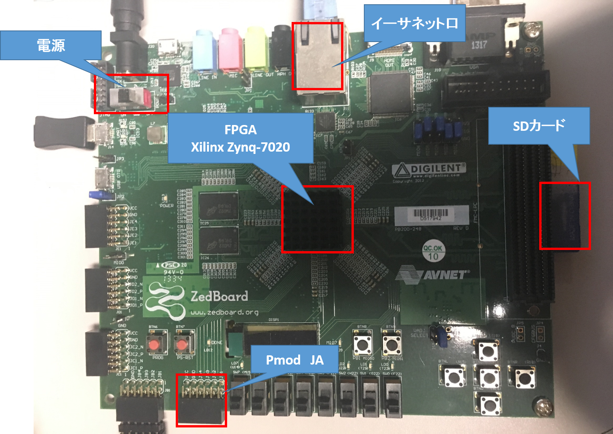

# 補足資料

### 専門用語と定義
本実験で使用する専門用語の解説です。
####　重要な言葉(概念)
- **FPGA (Field Programmable Gate Array)**  
	プログラミングによってハードウェア(デジタル回路)の動作やロジックの設計ができる半導体チップ。ハードウェアは何度も書き換えが可能で，Reconfigure Device(再設定可能なデバイス)もしくはProgrammable Logic Deviceの一種といえる。一般的にソフトウェアによる処理に対して，ハードウェア(FPGA)上に同一の処理を実装した場合，ハードウェアのほうが圧倒的に高速に処理が可能である。しかし，クロックサイクルごとにハードウェアはどのように動作するのか細かに記述する必要があり，開発負担が大きい。
- **FPGAボード**
	FPGAが搭載されたボード。
- **HDL (Hardware Discription Language)**  
	ハードウェア記述言語。デジタル回路を設計するための言語である。  
- **Verilog HDL**  
	HDLの一種。
- **FPGAコンポーネント**  
	任意のハードウェアに対して，ソフトウェア(CPU)とハードウェア(FPGA)間のデータ通信のルールを設定し，***ソフトウェアからハードウェアを制御できるようにする***ことを***FPGAコンポーネント化***と称す。コンポーネントの機能例として挙げられることは以下に示す。
	- ソフトウェアから回路へのコマンド送信
	- ソフトウェアから回路へのパラメータ入力
	- ハードウェア内で得られる処理結果をソフトウェアへ返す
- **Programmable SoC (System on Chip)**  
	FPGAとCPUが1枚のチップに集積されているもの。本実験では**ARMプロセッサとFPGAを集積したXilinu社のZynq-7020を搭載したZedboard**というFPGAボードを使用する。
- **Xillinux**  
	Xillybus社からリリースされているFPGA-ARM間のデータ通信が可能な,Zedboard用のLinuxディストリビューション(Ubuntu 12.04 LTS)。
- **ROS = Robot Operating System**  
	Open Source Robotics Foundationが開発・メンテナンスを行っており、ロボット開発者を支援するためのソフトウェアプラットフォーム。具体的にはロボットに必要なソフトウェアを開発するためのライブラリ，通信の仕組みを提供する。同時にビルドツールでもありワークディレクトリのビルド対象を全て一括でビルドできるcatkin_makeというコマンドを用いてビルドを行う。
- **自律移動型ロボット**  
	周囲の状況を把握し自律的に行動計画がたてられるようなロボット。また，バッテリ駆動のものを指す。

#### Verilog HDLに関する基本的な知識

- **always文、レジスタ宣言**  
always文は順序回路を記述するための文法です。また，レジスタは値をクロックとクロックの間保持することができる信号です。
以下の例ではクロックの立ち上がりの際にreg_inへsigの状態を保存するという回路記述となります。

```verilog
//          _    _    _    _
// clk    _| |__| |__| |__| |_
//             _________
// sig    ____|         |_____
//               _________
// reg_in ______|         |___
reg reg_in;
always @(posedge clk)begin
	if (rst)
		reg_in <= 0;
	else
		reg_in <= sig;
end
```

- **assign文とワイヤ（ネット宣言）**
assign文は簡単な組合せ回路を記述する際に用います。また，ワイヤ(ネット宣言)は内部配線で接続した信号の現在の状態をそのまま反映します。

```verilog
//           _    _    _    _
// clk     _| |__| |__| |__| |_
//               _________
// sig     _____|         |____
//               _________
// wire_in _____|         |____

wire wire_in;
assign wire_in = sig;

```

#### 使用する機材やソフトウェア
 - **Zedboard**  
	- 本実験で使用するFPGAボード



 - **Vivado2014.4**  
	- FPGAの回路の論理合成を行うためのソフトウェア。


