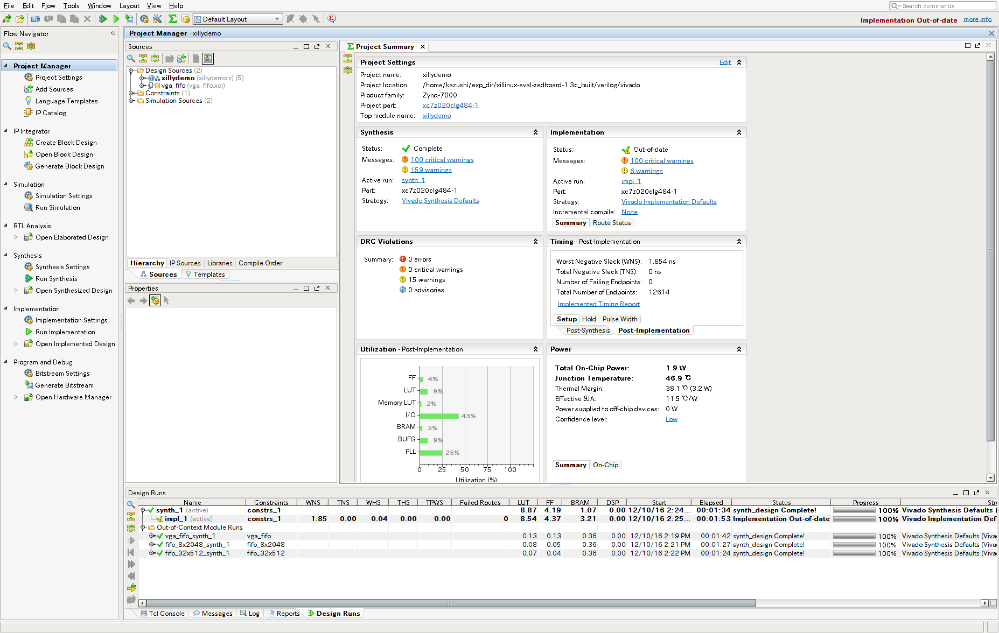
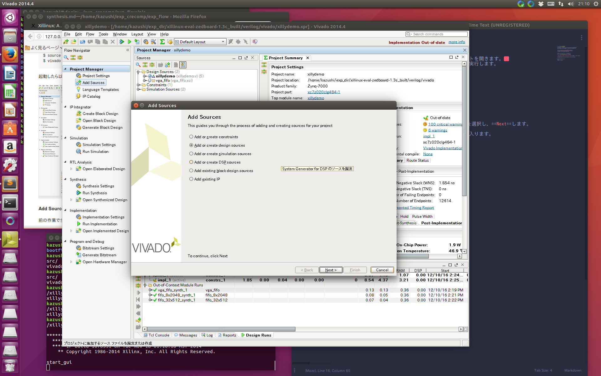
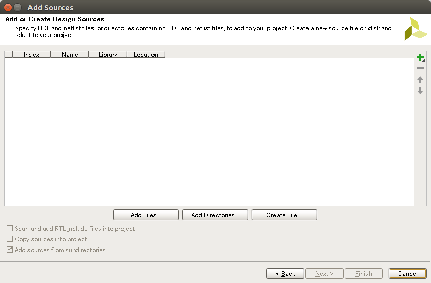
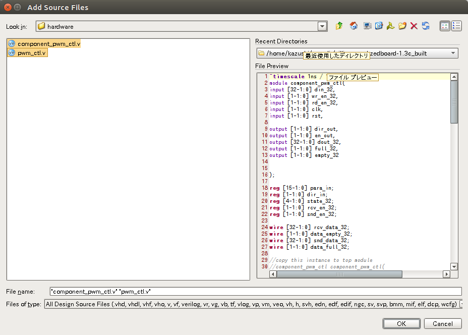
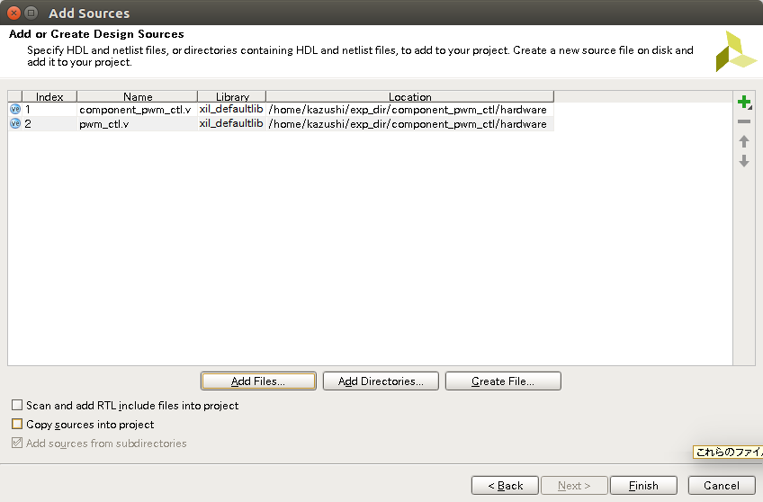
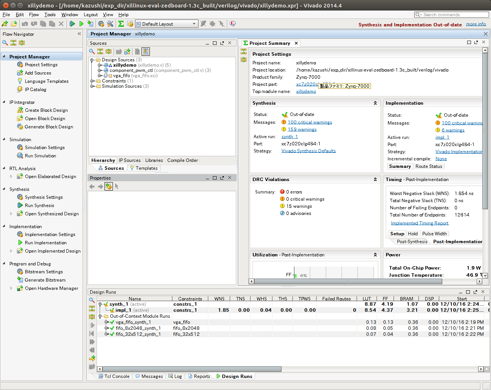
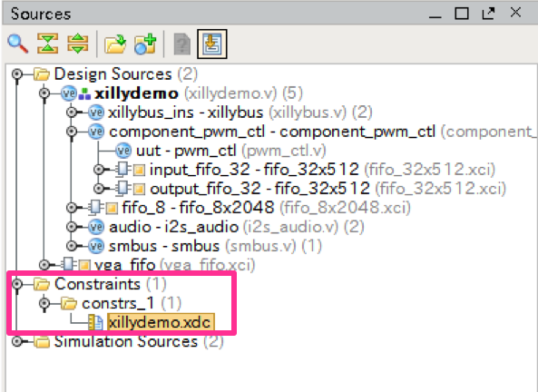
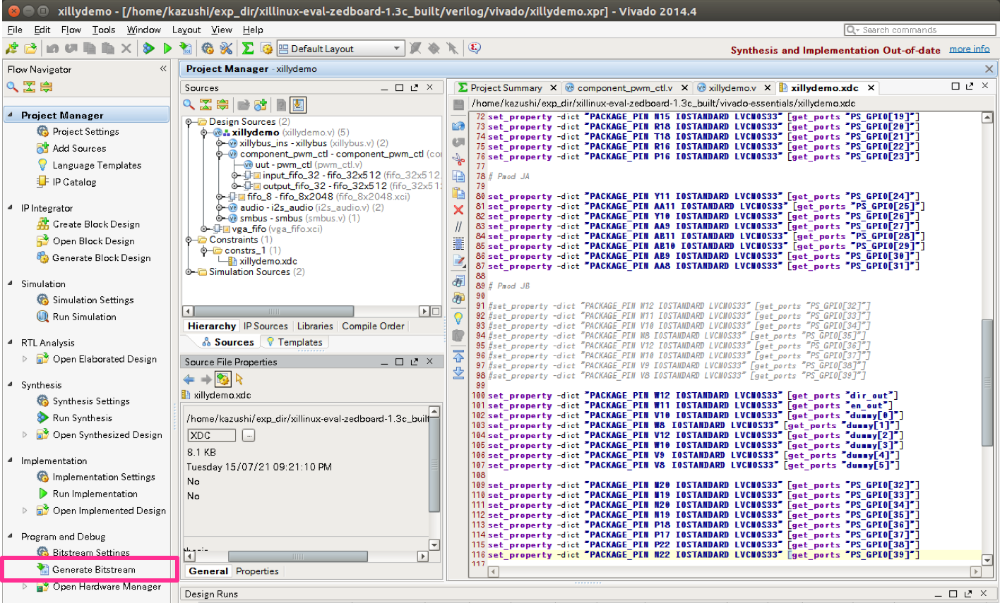
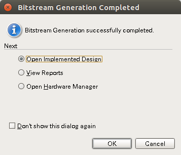

# ハードウェアの論理合成

前の作業において展開したハードウェアのプロジェクトを開きます。  
新しい端末(ターミナル)を起動し、以下のコマンドを実行します。

```
$ cd ~/exp_dir/xillinux-eval-zedboard-1.3c
$ source /opt/Xilinx/Vivado/2014.4/settings64.sh
$ vivado
```

起動したら以下のような**Tools -> Run Tcl Scripts**から、  
`~/exp_dir/xillinux-eval-zedboard-1.3c/verilog/xillydemo-vivado.tcl`を選択して、実行します。



**Add Sources -> Add or create design sources**を選択し、**Next**します。
前の作業で生成したハードウェアインターフェイスをインポートします。




`~/exp_dir/component_pwm_ctl/hardware`内の`component_pwm_ctl.v`と`pwm_ctl.v`を選択してOKします。



**Finish**を選択します。



ハードウェアをインポートすると以下の**Design Sources**の階層構造は以下のようになります。



**Design Sources**の**component_pwm_ctl**をダブルクリックで開きます。

開いたソースコードの29行目あたりに以下のような記述があります。この記述をコピーします。

```verilog
//copy this instance to top module
//component_pwm_ctl component_pwm_ctl(
//.clk(bus_clk),
//.rst(!user_w_write_32_open && !user_r_read_32_open),
//.din_32(user_w_write_32_data),
//.wr_en_32(user_w_write_32_wren),
//.rd_en_32(user_r_read_32_rden),
//.dout_32(user_r_read_32_data),
//.full_32(user_w_write_32_full),
//.empty_32(user_r_read_32_empty),
//.clk(clk),
//.rst(rst),
//.dir_out(dir_out),

//.en_out(en_out),
//);
```


cReCompで生成したハードウェアを接続します。  
**Design Sources**の**xillydemo**をダブルクリックで開きます。

262行目から以下のように編集します。`ctl+/`でコメントアウト・解除ができます。

```diff
// 262行目から273行目までコメントアウト
//   // 32-bit loopback
//   fifo_32x512 fifo_32
//     (
//      .clk(bus_clk),
//      .srst(!user_w_write_32_open && !user_r_read_32_open),
//      .din(user_w_write_32_data),
//      .wr_en(user_w_write_32_wren),
//      .rd_en(user_r_read_32_rden),
//      .dout(user_r_read_32_data),
//      .full(user_w_write_32_full),
//      .empty(user_r_read_32_empty)
//      );

//すぐ下に先ほどコピーしたものを貼り付け＆コメント解除
    component_pwm_ctl component_pwm_ctl(
    .clk(bus_clk),
    .rst(!user_w_write_32_open && !user_r_read_32_open),
    .din_32(user_w_write_32_data),
    .wr_en_32(user_w_write_32_wren),
    .rd_en_32(user_r_read_32_rden),
    .dout_32(user_r_read_32_data),
    .full_32(user_w_write_32_full),
    .empty_32(user_r_read_32_empty),
-    .clk(clk),
-    .rst(rst),
    .dir_out(dir_out),
-    .en_out(en_out),
+    .en_out(en_out) //コンマ削除
    );

```

また、同じファイル内の上部にあるインターフェイスに信号を追加します。  
19行目あたりを以下のように編集します。

```diff
module xillydemo
  (
  input  clk_100,
  input  otg_oc,
  inout [55:0] PS_GPIO,
  output [3:0] GPIO_LED,
  output [3:0] vga4_blue,
  output [3:0] vga4_green,
  output [3:0] vga4_red,
  output  vga_hsync,
  output  vga_vsync,

  output  audio_mclk,
  output  audio_dac,
  input   audio_adc,
  input   audio_bclk,
  input   audio_lrclk,

  output smb_sclk,
  inout  smb_sdata,
-  output [1:0] smbus_addr
+  output [1:0] smbus_addr, //コンマ追加

+ output dir_out,
+ output en_out,
+ output [5:0] dummy

  );
```


また、制約ファイルの編集をします。**Design Sources**の**Constraints**をクリックし、**xillydemo.xdc**を開きます。



90行目あたりを以下のように編集します。


```c
# 90行目からコメントアウト
#set_property -dict "PACKAGE_PIN W12 IOSTANDARD LVCMOS33" [get_ports "PS_GPIO[32]"]
#set_property -dict "PACKAGE_PIN W11 IOSTANDARD LVCMOS33" [get_ports "PS_GPIO[33]"]
#set_property -dict "PACKAGE_PIN V10 IOSTANDARD LVCMOS33" [get_ports "PS_GPIO[34]"]
#set_property -dict "PACKAGE_PIN W8 IOSTANDARD LVCMOS33" [get_ports "PS_GPIO[35]"]
#set_property -dict "PACKAGE_PIN V12 IOSTANDARD LVCMOS33" [get_ports "PS_GPIO[36]"]
#set_property -dict "PACKAGE_PIN W10 IOSTANDARD LVCMOS33" [get_ports "PS_GPIO[37]"]
#set_property -dict "PACKAGE_PIN V9 IOSTANDARD LVCMOS33" [get_ports "PS_GPIO[38]"]
#set_property -dict "PACKAGE_PIN V8 IOSTANDARD LVCMOS33" [get_ports "PS_GPIO[39]"]

#以下の記述をコピー&ペースト
set_property -dict "PACKAGE_PIN W12 IOSTANDARD LVCMOS33" [get_ports "dir_out"]
set_property -dict "PACKAGE_PIN W11 IOSTANDARD LVCMOS33" [get_ports "en_out"]
set_property -dict "PACKAGE_PIN V10 IOSTANDARD LVCMOS33" [get_ports "dummy[0]"]
set_property -dict "PACKAGE_PIN W8 	IOSTANDARD LVCMOS33" [get_ports "dummy[1]"]
set_property -dict "PACKAGE_PIN V12 IOSTANDARD LVCMOS33" [get_ports "dummy[2]"]
set_property -dict "PACKAGE_PIN W10 IOSTANDARD LVCMOS33" [get_ports "dummy[3]"]
set_property -dict "PACKAGE_PIN V9 	IOSTANDARD LVCMOS33" [get_ports "dummy[4]"]
set_property -dict "PACKAGE_PIN V8 	IOSTANDARD LVCMOS33" [get_ports "dummy[5]"]

set_property -dict "PACKAGE_PIN M20 IOSTANDARD LVCMOS33" [get_ports "PS_GPIO[32]"]
set_property -dict "PACKAGE_PIN M19 IOSTANDARD LVCMOS33" [get_ports "PS_GPIO[33]"]
set_property -dict "PACKAGE_PIN N20 IOSTANDARD LVCMOS33" [get_ports "PS_GPIO[34]"]
set_property -dict "PACKAGE_PIN N19 IOSTANDARD LVCMOS33" [get_ports "PS_GPIO[35]"]
set_property -dict "PACKAGE_PIN P18 IOSTANDARD LVCMOS33" [get_ports "PS_GPIO[36]"]
set_property -dict "PACKAGE_PIN P17 IOSTANDARD LVCMOS33" [get_ports "PS_GPIO[37]"]
set_property -dict "PACKAGE_PIN P22 IOSTANDARD LVCMOS33" [get_ports "PS_GPIO[38]"]
set_property -dict "PACKAGE_PIN N22 IOSTANDARD LVCMOS33" [get_ports "PS_GPIO[39]"]
```

これでハードウェアのインポートは終了です。  
**Generate Bitstream**を実行します。（時間がかかります。）




終了したら、以下のようなダイアログが出ます。**Cancel**を選択します。



# BOOT.binの作成

BOOT.binを作成します。  
BOOT.binはZedboard上でLinuxをブートするためのブートローダです。

```
$ ~/exp_dir/bootgen
$ source /opt/Xilinx/Vivado/2014.4/settings64.sh
$ cp ../xillinux-eval-zedboard-1.3c/verilog/vivado/xillydemo.runs/impl_1/xillydemo.bit .
$ python bootgen_zynq.py xillydemo.bit
```

生成に成功すると`~/exp_dir/bootgen`にBOOT.binができています。

SDカードをPCに挿入し、BOOT.binをZED_BOOTにコピーします。

