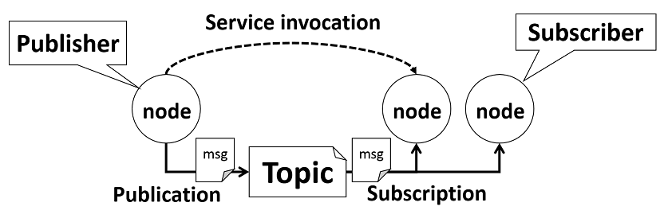
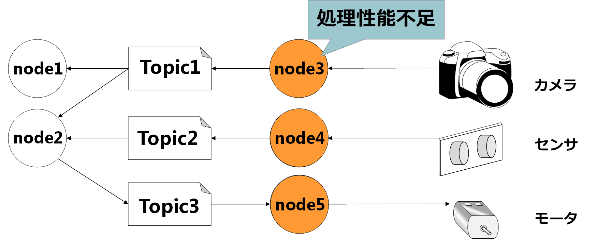
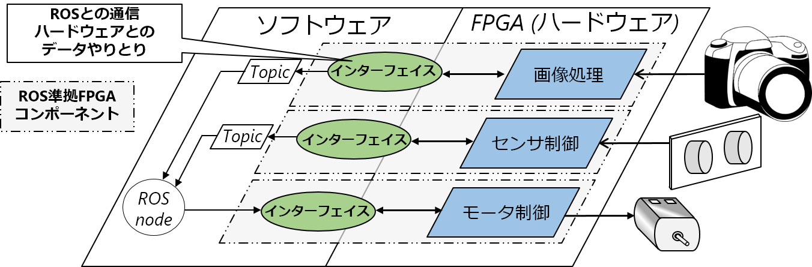
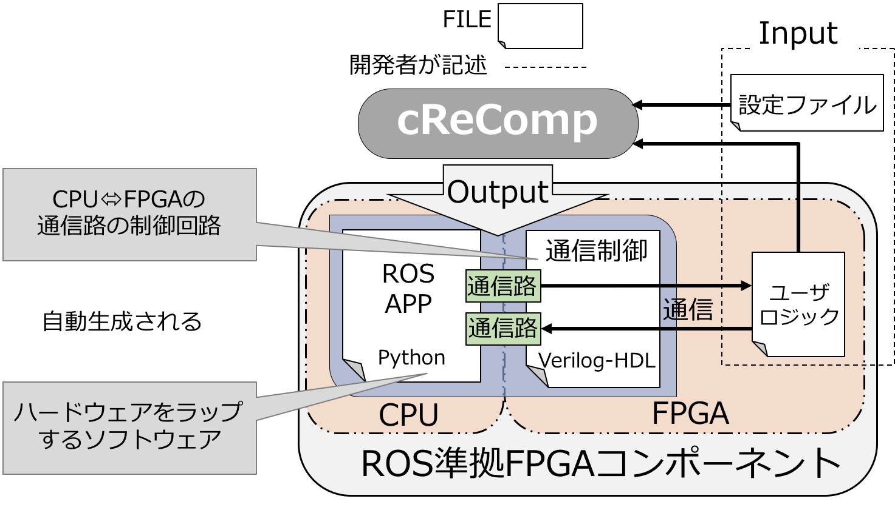

# 研究背景
この資料は協力していだたく実験を行う前の事前知識を補う目的で作成した資料です．  
被験者の皆様はお手数ですが，全ての資料について一度，目を通していただくようにお願いいたします．

##はじめに
周囲の状況に応じて行動する**自律移動型ロボット**は知的画像処理などの非常に複雑活膨大な計算を行う必要があります．
高い処理性能が要求されているの対し自律移動型ロボットのバッテリ駆動のため，低消費電力化の観点から処理性能の高いプロセッサは搭載できず処理性能不足となる問題があります．  

我々はこうした問題を解決するために，ロボット制御のプラットフォームとして電力性能比が高い**FPGA(Field Programmable Gate Array)**に注目しています．しかし，FPGAにおける開発は一般のプログラミング言語(CやJava)に比べて**HDL(Hardware Description Language)**による開発となるため，開発者への負担が大変大きいです．このような問題を解決し，FPGAを容易にロボットへ導入するため，ロボットシステムの開発運用のためのソフトウェアプラットフォームである**ROS**に準拠した，FPGAのソフトウェアコンポーネント化を提案しています．  

実験では**cReComp**というコンポーネント自動設計ツールを使用し，**FPGA向けの回路のコンポーネント化**を行います．またコンポーネントの設計の容易さなどを被験者のみなさんに評価していただきます．  

## FPGAとは
プログラミングによってハードウェア(デジタル回路)の動作やロジックの設計ができる半導体チップのことです．ハードウェアは何度も書き換えが可能で，Reconfigure Device(再設定可能なデバイス)もしくはProgrammable Logic Deviceの一種といえるでしょう．一般的にソフトウェアによる処理に対して，ハードウェア(FPGA)上に同一の処理を実装した場合，ハードウェアのほうが圧倒的に高速に処理が可能です．しかし，FPG
Aをプログラミングする際は，クロックサイクルごとにハードウェアはどのように動作するのか細かに記述する必要がありますので，開発負担が大変大きい事が知られます．

##ROS(Robot Operatying System)とは
Open Source Robotics Foundationが開発・メンテナンスを行っており，ロボット開発者を支援するためのソフトウェアプラットフォームです．
具体的にはロボットに必要なソフトウェアを開発するためのライブラリ，通信の仕組みを提供します．またソフトウェアのビルドツールでもあります．

###ROSを用いたロボットとは

上の図はロボットシステムの例であり，青い丸１つ１つがソフトウェアを表してます．近年のロボット開発ではこのように単一のソフトウェアではなく複数のソフトウェアを使用してロボットシステムを構築する手法が主流となってきています．各ソフトウェアは一種類の機能を持ち，これを**コンポーネント（ソフトウェア部品）**と呼びます．また，各コンポーネント同士がデータ通信を行うことで連携し，一つのロボットシステムとしての役割を果たします．このように単一ソフトウェアによるロボットシステムではなく，複数コンポーネントを用いてロボットシステムを開発することを **コンポーネント指向開発**と言います．  

ROSはコンポーネント指向開発を支援するフレームワークであり，ROSにおいてロボットシステムを構築する場合にも上の図のような複数のソフトウェアを用いて開発を行います．

###ROSの通信モデル

ROSでは***Publish/Subscribeメッセージング***と呼ばれる通信モデルで**ノード（ソフトウェアコンポーネント）**同士が通信します．
各要素の役割は以下に示します．

- **Message**：ROSでやりとりするデータ．**中身のデータ構造はROSにあらかじめ用意されているものか独自の定義が可能**
- **Topic**：メッセージを分類する系統ごとに作成される論理チャネル
- **Publisher**：メッセージを特定のトピックへ配信するノード
- **Subscriber**：特定のトピックを購読対象として登録しメッセージを受信するノード
- **roscore**：ROSの通信におけるネームサービスを行う．マスタ．

ROSでは**Publisher**と**Subscriber**が**Topic**を介して**Message**をやり取りすることでデータ通信をします．
Publish/Subscribeの特徴として，P2Pな通信であることがあげられます．これは互いが通信相手の情報を知る必要はなく，ノード構成ネットワークへの脱退，参加が容易になるという利点があります．
つまりこれはシステムへの機能の追加・変更がとても容易になるということです．また，1対1の通信専用の方法としてROS Serviceもあり，一般的なサーバー/クライアント方式の通信も可能です．
実際に通信する際は，PublisherとSubscriberはそれぞれPublish/SubscribeするTopicの情報をrosocoreに登録し，通信をします．それゆえに，ROSのシステム動作にはroscoreの起動は必須といえます．

##ROS準拠FPGAコンポーネント
FPGAの開発生産性の悪さは前述した通りです．また，ロボット開発においても様々な分野の知識が必要となるため，開発コストが高いです．したがって，FPGAを使用したい場合に，FPGAの扱いが難しく導入しづらいという現状があります．そこで，我々の提案する**ROS準拠FPGAコンポーネント**技術を用いることで，FPGAをロボットシステム上のコンポーネントと同じように扱えるようにする事ができます．

FPGAのROS準拠コンポーネント化を行う最大の目的はFPGAの利点を生かしつつ，ソフトウェアによる制御を可能にすることで，FPGAを容易にロボットへ導入できるようにすることです．以下のようなソフトウェアのみで構築されたシステムにおいて処理不足となるような処理をFPGAによってハードウェア化しても，ハードウェアとソフトウェアのデータ通信設計が大変難しいです．したがって，FPGAの回路ごとにソフトウェアとの通信を行なうインターフェイスを設けることで，ハードウェアを意識することなくソフトウェアと同一に扱うことができます．この際，コンポーネントはROSのプロセス通信モデル(Publish/Subscribeメッセージング)に準拠します．

	
	

##自動コンポーネント化ツール cReComp
ROS準拠FPGAコンポーネントを使用することで，ロボットシステムへFPGA導入は容易になります．しかし，FPGAの回路をコンポーネントかする開発コストは依然として高いままです．その原因として，ハードウェアとソフトウェア間の通信を設計する必要がある事が挙げられます．それゆえに現在，FPGAの回路があれば自動的にROS準拠のコンポーネントを生成できる設計ツール**cReComp**を開発してます．本資料では実験の前にcReCompにおけるコンポーネント化を行っていただきます．

cReCompではCPUとFPGAが同一チップに搭載されてある**Programmable SoC**をいうデバイスで動作するコンポーネントを生成します．このようなデバイスではCPUとFPGAの間にデータ通信を行うためのバスシステムが用意されてあり，ソフトウェアからFPGAへ，もしくFPGAからソフトウェアへのデータのやりとりが可能です．しかし，この通信をを使用するための回路設計などが大変難しいです．cReCompでは通信路の設計や回路記述を含めて，コンポーネントの生成が可能です．

上の図はcReCompのコンポーネント生成モデルです．cReCompに与える入力はコンポーネント化の対象となる回路**ユーザロジック**と通信のルールを決めるための設定ファイルです．ここでいう「通信ルール」はFPGAがCPUから何回データを受信するかなどのことです．コンポーネント化のための設定ファイルはプログラミング言語のPythonによって記述する事ができます．

また，cReCompからの出力は，CPUとFPGAのデータ通信制御を担うハードウェア（図中の制御回路）と，その回路をラップするROS準拠のソフトウェアです．cReCompではこのようなユーザロジック（FPGA）とCPUがデータ通信するための，ハードウェアとソフトウェアからなる**インターフェイス**が生成されます．このインターフェイスが付いたコンポーネントをROS準拠FPGAコンポーネントとします．

