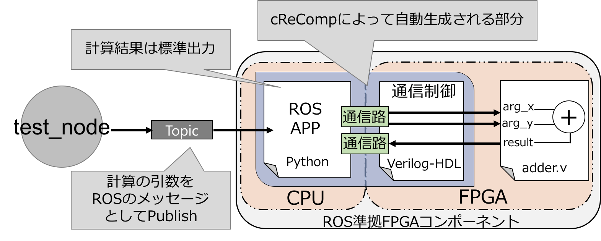

# cReCompを用いた<br>FPGAモジュールのコンポーネント化
このチュートリアルでは簡単なFPGAモジュールのコンポーネント化を行います。

本チュートリアルで使用するFPGAモジュールは以下のようなものです。

```verilog
`timescale 1ns / 1ps
module adder(
	input [15:0] arg_x,
	input [15:0] arg_y,
	output [31:0] result
);

assign result = arg_x + arg_y;

endmodule
```

この回路はinput信号である、`arg_x`、`arg_y`に入力値を与えることで、output信号`result`に加算した結果を返すという簡単な機能を持ちます。  

また、下の図はこのチュートリアルで生成するコンポーネントのシステム構成です。



本チュートリアルではこの2つの信号にソフトウェアから入力値を与え、計算結果もソフトウェアにおいて受け取ることのできるようなコンポーネントを作成します。  

### 設定用ファイルのテンプレート生成

`pre_instruction/example/adder.v`があるかどうか確認します。

```
$ cd pre_instruction/example
$ ls
adder.v
```

cReCompを用いて、コンポーネント生成のための設定用ファイルを作ります。

- -p : 設定用ファイルの名前
- -u : コンポーネント化対象のFPGAの回路(ユーザロジック)

`Generate config.py successfully`と出力されれば成功です。

```
$ crecomp -p config.py -u adder.v
Generate config.py successfully
```

生成された`config.py`は以下のようなものです。  
コードの詳細はコメントによって説明を追加しています。

```python
# -*- coding: utf-8 -*-
import crecomp.userlogic as ul
import crecomp.component as cp
import crecomp.verilog as vl
import crecomp.communication as com

# User logicに応じて生成されるクラス
# User logicのもつ入出力信号などの情報を持つ
class Adder(ul.Util):

	def __init__(self,uut):
		self.name = "adder"
		self.filepath = "adder.v"
		self.uut = uut
		self.ports =[
		vl.Input("arg_x", 16),
		vl.Input("arg_y", 16),
		vl.Output("result", 32)
		]
		self.assignlist = []


# コンポーネントの設定をするためのクラスのインスタンス
cp_adder = cp.Component("component_adder")

# ==================== for userlogic adder.v ====================
# User logicのクラスのインスタンス
adder = Adder("uut")

# adding signal for connection to user logic
cp_adder.add_input("arg_x",16)
cp_adder.add_input("arg_y",16)
cp_adder.add_output("result",32)

# cp_adder.add_reg("arg_x",16)
# cp_adder.add_reg("arg_y",16)
# cp_adder.add_wire("result",32)

# communication setting
fifo_32 = com.Xillybus_fifo(1,1,"1",32)
# fifo_32.assign(action = "rcv", sig = "signal_name")
# fifo_32.assign(action = "snd", sig = "signal_name")
cp_adder.add_com(fifo_32)

# fifo_8 = com.Xillybus_fifo(1,1,"1",8)

# fifo_8.assign(action = "rcv", sig = "signal_name")
# fifo_8.assign(action = "snd", sig = "signal_name")
# cp_adder.add_com(fifo_8)

# connection between software and user logic
adder.assign("arg_x","arg_x")
adder.assign("arg_y","arg_y")
adder.assign("result","result")

cp_adder.add_ul(adder)
cp_adder.ros_packaging()

cp_adder.componentize()

```

編集する箇所を解説していきます。まず、<font color="red">**コンポーネントのハードウェアインターフェイスに必要な信号を追加します。**</font>  
特に、**ソフトウェアから引数をもらうためのregister信号**と**計算結果をソフトウェアへ返すためにのwire信号**が必要となります。

```diff
# adding signal for connection to user logic
- cp_adder.add_input("arg_x",16)
- cp_adder.add_input("arg_y",16)
- cp_adder.add_output("result",32)

+ cp_adder.add_reg("arg_x",16)		# コメント解除
+ cp_adder.add_reg("arg_y",16)		# コメント解除
+ cp_adder.add_wire("result",32)	# コメント解除

```

次に、adder.vとソフトウェアが通信するための設定をします。回路への入力は16bitのinput信号**arg_x**と**arg_y**の2つです。
cReCompではCPUとFPGAの通信路の幅に32bitと8bitをサポートしています。今回は2つの信号を合わせて32bitですので引数を1回入力(CPU→FPGA)するには1回のデータ入力のみで良い、ということになります。  

また、adder.vで加算した結果をソフトウェア側へ送信する必要があります。**result**は32bitの信号なので、FPGAからCPUへの出力は1回ということになります。

したがって、設定すべき内容は以下のようになります。

- ソフトウェアからハードウェアへデータを受信する回数：1回
- データ受信のために使う信号
	- register信号 : arg_x
	- register信号 : arg_y
- ハードウェアからソフトウェアへデータを送信する回数：1回
- データ送信のために使う信号
	- wire : result

```diff
# communication setting
# rcvとsndの違いに注意
fifo_32 = com.Xillybus_fifo(1,1,"1",32)
-fifo_32.assign(action = "rcv", sig = "signal_name")
- fifo_32.assign(action = "snd", sig = "signal_name")
+ fifo_32.assign(action = "rcv", sig = "arg_x")
+ fifo_32.assign(action = "rcv", sig = "arg_y")
+ fifo_32.assign(action = "snd", sig = "result")
cp_adder.add_com(fifo_32)
```

なお、データの送受信回数はデフォルトで1回となっているため、変更は必要ありません。

これで設定は完了です。  

コンポーネント化を実行します。以下のコマンドを実行してください。  
`Generate component successfully`が出力されたら成功です。

```
$ python config.py
Generate component successfully
```


